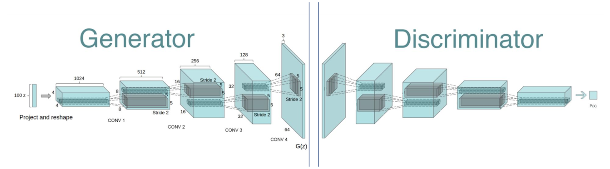

# Training Deep Convolutional Generative Adversarial Networks (DCGANs)
## Experimenting with small datasets, colors and patterns

Training GANs in an adversarial setting means training two networks simultaneously and iteratively: the generator G, a generative model, that aims to replicate a data distribution (starting from random noise), which is then fed to the Discriminator D, a discriminative model, that estimates the probability of this data distribution coming from the training data rather than G, by simple classification (fake or real, 0 or 1). [1]

The layers of DCGANs change from fully connected layers in the orginial GANs to transpose convolutional for the Generator and convolutional layers for the Discriminator architecture. 

**Architecture guidelines for stable Deep Convolutional GANs:** [2]
* Replace pooling layers with strided convolutions (Discriminator) and fractional-strided convolutions (Generator). 
* Batchnorm in both the Generator and the Discriminator. 
* Remove fully connected hidden layers for deeper architectures. 
* ReLU activation in Generator for all layers except for the output, > Tanh. 
* LeakyReLU activation in the Discriminator for all layers.

## Experimental setup:

**Objective:** Generate images of oceans and mountains
**Dataset:** Oceans (~600 images), mountains (~700 images); clean data (size: 64x64)
**Training:** 350 epochs

Many GANs projects focus on faces. However, due to intricate facial details including shapes (face, eyes, nose, lips, glasses, ...), texture (hair, skin, ...), nuances of colors (hair, skin, ...) generating high quality images of faces can take weeks of training. [3] The prerequisite is access to a large database.

By reducing the complexity of shapes, texture and colors we can achieve good results in less time with less data.

Why oceans and mountains?
Both have distinct features. Oceans show few difficulties in terms of shapes and texture and have one nuanced base color. Mountains are more detailed in terms of shapes and texture, however the scope of mountain landscapes allows many different variations and thus, would still be recognized as mountains.

**References**

[1] Goodfellow, I., Pouget-Abadie, J., Mirza, M., Xu, B., Warde-Farley, D., Ozair, S., ... & Bengio, Y. (2014). Generative adversarial nets. In Advances in neural information processing systems (pp. 2672-2680). https://arxiv.org/abs/1406.2661

[2] Radford, A., Metz, L., & Chintala, S. (2015). Unsupervised representation learning with deep convolutional generative adversarial networks. arXiv preprint arXiv:1511.06434. https://arxiv.org/pdf/1511.06434.pdf

[3] Progressive Growing of GANs for Improved Quality, Stability, and Variation. https://www.youtube.com/watch?v=XOxxPcy5Gr4
